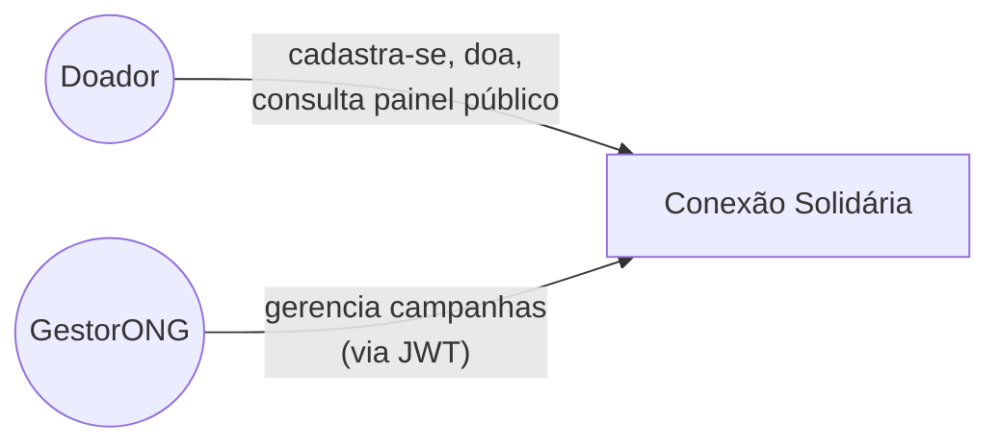
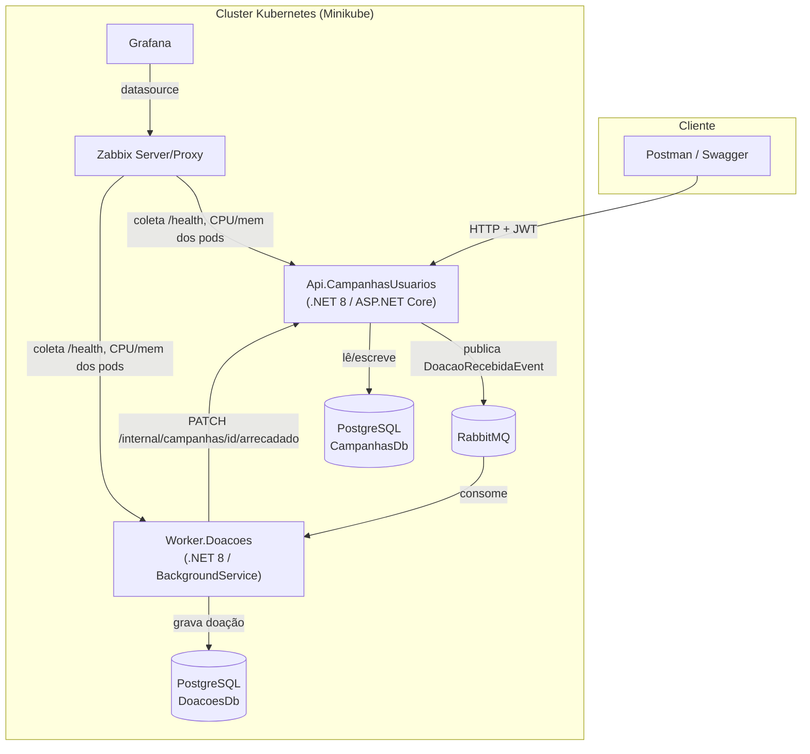

# Documento de Arquitetura — Conexão Solidária

| Campo | Valor |
|---|---|
| Projeto | Conexão Solidária |
| Arquiteto | Grupo do Hackathon |
| Aprovador | — (autoaprovado, contexto acadêmico) |
| Versão / Data | 1.1 — 2026-08-29 |
| BRD de origem | `docs/brd.md` |

## 1. Visão Geral

Estilo arquitetural: **microsserviços com comunicação assíncrona via mensageria**,
justificado em detalhe na [ADR-001](adr/ADR-001-arquitetura-microsservicos.md). O sistema é
composto por dois serviços — `Api.CampanhasUsuarios` (caminho síncrono: auth, campanhas,
doadores, painel público) e `Worker.Doacoes` (caminho assíncrono: processamento de doações)
— cada um com modularidade interna própria (Auth / Campanhas / Doadores como módulos
distintos dentro da API).

## 2. Requisitos e Restrições

Ver `docs/brd.md`, seções 5 (Requisitos Funcionais) e 6 (Requisitos Não-Funcionais).
Restrição principal: prazo curto do hackathon, o que orienta todas as decisões técnicas
para a opção mais simples que ainda atenda ao requisito obrigatório (ver ADRs).

## 3. Decisões Arquiteturais (ADR)

| ADR | Decisão | Status |
|---|---|---|
| [ADR-001](adr/ADR-001-arquitetura-microsservicos.md) | Microsserviços em vez de monolito modular | Aceita |
| [ADR-002](adr/ADR-002-mensageria-rabbitmq.md) | RabbitMQ como broker | Aceita |
| [ADR-003](adr/ADR-003-banco-por-servico.md) | PostgreSQL isolado por serviço | Aceita |
| [ADR-004](adr/ADR-004-atualizacao-saldo-callback-http.md) | Atualização de saldo via callback HTTP do Worker para a API | Aceita |
| [ADR-005](adr/ADR-005-observabilidade-zabbix-grafana.md) | Zabbix (coleta) + Grafana (visualização) | Aceita |
| [ADR-006](adr/ADR-006-orquestracao-minikube.md) | Minikube como cluster local | Aceita |
| [ADR-007](adr/ADR-007-infraestrutura-aws-terraform.md) | Infraestrutura AWS complementar (k3s em EC2 + RDS compartilhado) via Terraform em repositório separado | Aceita |

## 4. Visão Arquitetural

### C4 Nível 1 — Contexto

### C4 Nível 2 — Contêineres

## 5. Infraestrutura e Deploy

O sistema roda em **dois ambientes**, a partir dos mesmos manifests Kubernetes (via
Kustomize — `base/` + overlay `local` + overlay `aws`):

- **Local (obrigatório pelo enunciado)**: Minikube (ADR-006), com addon `metrics-server`
  habilitado para expor consumo de CPU/memória dos pods. RabbitMQ, PostgreSQL (x2), Zabbix e
  Grafana rodam todos dentro do cluster.
- **AWS (complementar, ver ADR-007)**: k3s em uma única instância EC2, provisionada via
  Terraform em repositório separado. Bancos de dados em uma instância RDS PostgreSQL
  compartilhada (duas databases lógicas: `campanhas` e `doacoes`). RabbitMQ, Zabbix e Grafana
  continuam dentro do cluster (não como serviços gerenciados). Imagens Docker publicadas no
  ECR pelo pipeline de CI. Ambiente feito para ser descartável — `terraform destroy` remove
  tudo, sem persistência de dados entre ciclos.

Comum aos dois ambientes:

- **Manifests**: um `Deployment` + `Service` por serviço (`api-campanhas-usuarios`,
  `worker-doacoes`), mais Deployments/Services para RabbitMQ, PostgreSQL (local) ou
  `ExternalName`/Secret apontando para o RDS (AWS), Zabbix e Grafana. Configuração não
  sensível em `ConfigMap`; strings de conexão, chave JWT e o shared secret do callback
  interno em `Secret`.
- **CI**: GitHub Actions disparado a cada push em `main` — restore/build/test do .NET
  seguido da geração das imagens Docker dos dois serviços (publicadas no ECR quando o
  destino é AWS). Deploy automatizado no cluster é opcional e fica fora do escopo mínimo
  do MVP (conforme permitido pelo enunciado), mas é aplicado manualmente/via Terraform no
  ambiente AWS.
- **Deploy strategy**: rolling update padrão do Kubernetes (`Deployment` nativo) — suficiente
  para um MVP sem exigência de zero-downtime em nenhum dos dois ambientes.

## 6. Segurança

- Autenticação via JWT; roles `GestorONG` e `Doador` como claim no token.
- Autorização por atributo (`[Authorize(Roles = "GestorONG")]`) nos endpoints de gestão de
  campanhas.
- Senhas de doador armazenadas com hash BCrypt, nunca em texto plano.
- CPF validado por formato/dígito verificador no cadastro do doador.
- Segredos (connection strings, chave de assinatura JWT) providos via Kubernetes `Secret`,
  não `ConfigMap` — mais rígido do que o mínimo pedido no enunciado.
- Endpoint interno de callback (`PATCH /internal/campanhas/{id}/arrecadado`, ver ADR-004)
  exige um header `X-Internal-Token` validado contra um shared secret, e não é roteado
  publicamente nem no ambiente local nem no AWS — apenas os endpoints públicos de
  `Api.CampanhasUsuarios` são expostos via `Service`/LoadBalancer no ambiente AWS.

## 7. Observabilidade

Detalhada na [ADR-005](adr/ADR-005-observabilidade-zabbix-grafana.md).

- `Api.CampanhasUsuarios` e `Worker.Doacoes` expõem `/health` (liveness/readiness do k8s).
- Zabbix coleta métricas de infraestrutura dos pods (CPU/memória) e healthchecks HTTP.
- Grafana consome o Zabbix como datasource e exibe um dashboard com as métricas reais dos
  serviços em execução.

## 8. Estratégia de Dados

Detalhada na [ADR-003](adr/ADR-003-banco-por-servico.md) e na
[ADR-004](adr/ADR-004-atualizacao-saldo-callback-http.md). **Esta seção corresponde ao
entregável obrigatório do enunciado: "Documento em PDF justificando por que os bancos de
dados X e Y foram escolhidos".**

**Banco X — `CampanhasDb` (PostgreSQL), usado por `Api.CampanhasUsuarios`**
Armazena usuários (doadores), campanhas e o valor total arrecadado por campanha. Dados
fortemente relacionais, com regras de integridade claras (meta financeira > 0, unicidade de
e-mail) que se beneficiam de constraints e transações ACID de um banco relacional.

**Banco Y — `DoacoesDb` (PostgreSQL), usado por `Worker.Doacoes`**
Armazena o ledger de doações processadas (auditoria de cada evento consumido da fila). Os
dados também são estruturados (campanha, valor, timestamp) e não há necessidade funcional
de um modelo de documento ou NoSQL — a escolha de manter a mesma tecnologia (PostgreSQL)
evita introduzir uma tecnologia extra a operar em Kubernetes sem ganho técnico real.

**Por que dois bancos, e não um só**: a separação não é sobre tecnologia (ambos são
PostgreSQL), mas sobre **propriedade de dados por serviço** — princípio central da
arquitetura de microsserviços adotada na ADR-001. Cada serviço só escreve no seu próprio
banco; a sincronização do valor arrecadado entre os dois acontece via chamada HTTP interna
descrita na ADR-004, não via acesso direto a um schema compartilhado.

## 9. Riscos e Mitigações

Ver `docs/brd.md`, seção 10 (Riscos de Negócio) — RN-01 e RN-02.

## 10. Glossário

| Termo | Definição |
|---|---|
| GestorONG | Role com permissão de gerenciar campanhas |
| Doador | Role pública que se cadastra e realiza doações |
| DoacaoRecebidaEvent | Evento publicado pela API na fila do RabbitMQ ao receber uma intenção de doação |
| Ledger de doações | Registro histórico de doações processadas, mantido pelo `Worker.Doacoes` |

## 11. Histórico de Revisões

| Versão | Data | Autor | Alteração |
|---|---|---|---|
| 1.0 | 2026-08-29 | Grupo do Hackathon | Versão inicial |
| 1.1 | 2026-08-29 | Grupo do Hackathon | Adiciona ambiente AWS complementar (ADR-007) |
